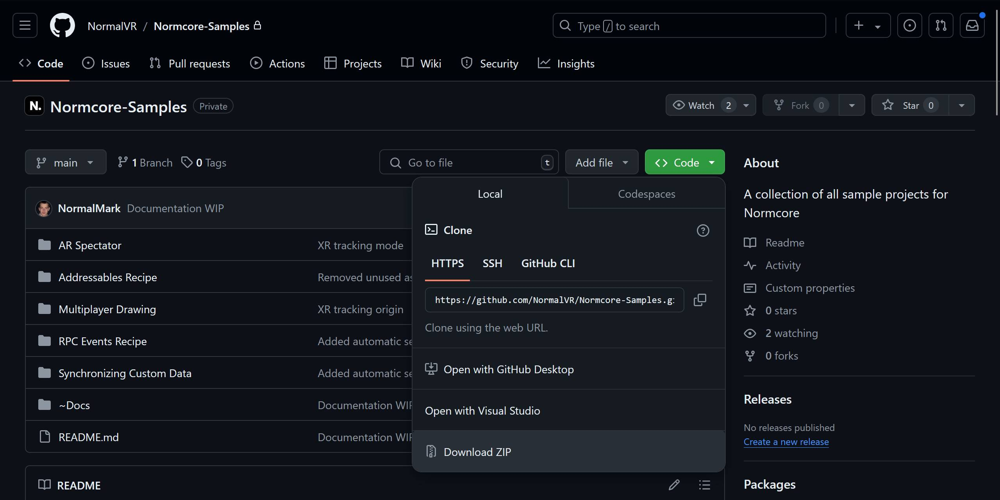
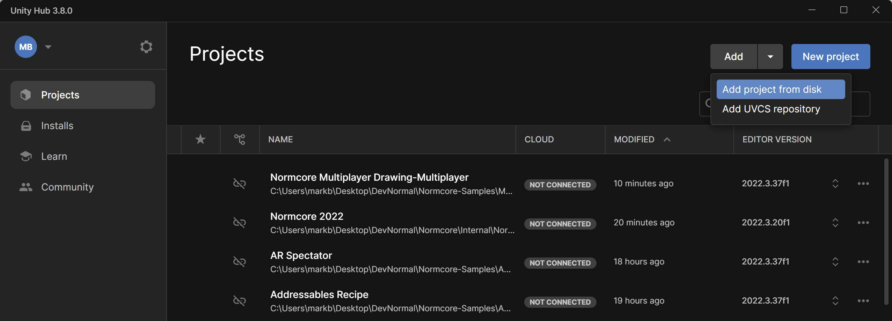

# Normcore Samples
[Normcore](https://normcore.io/) is a multiplayer SDK and game server hosting service for Unity. The Normcore unitypackage comes with some basic Examples to get you started. This repository contains larger sample projects that demonstrate more complex multiplayer concepts.

## Guides
Each sample project in this repository is accompanied by a guide that walks you through how to create it from scratch:
* [Creating a Multiplayer Drawing App](https://docs.normcore.io/guides/creating-a-multiplayer-drawing-app)
* [Using AR as a Spectator View for Your XR App](https://docs.normcore.io/guides/using-ar-as-a-spectator-view)
* [Synchronizing Custom Data](https://docs.normcore.io/realtime/synchronizing-custom-data)
* [Recipe: RPC Events](https://docs.normcore.io/guides/recipes/rpc-events)
* [Recipe: Using Addressables](https://docs.normcore.io/guides/recipes/using-addressables)

# Downloading the samples
You can download the samples from the [Releases page](https://github.com/NormalVR/Normcore-Samples/releases).

Alternatively, you can clone the repo using [git](https://docs.github.com/en/get-started/using-git/about-git). Or click "Download ZIP" and unzip the contained files.

# Opening the samples
* Download and open [Unity Hub](https://unity.com/unity-hub).
* Click "Add project from disk" and select the root directory of the sample you'd like to open.
* If Unity Hub prompts you to install the editor, proceed with the installation.

# Running the samples
## Preparation
* Open the main scene inside the sample project
* If you don't already have one, create a Normcore account and an app in our dashboard as described on our [getting started](https://docs.normcore.io/essentials/getting-started) page.
* Copy your app key into the `Realtime` component and save the scene.

## Running
* Enter Play mode by pressing the Play button to launch the sample inside the editor.
* There are a few options to run multiple instances of the sample for testing multiplayer:
  * Create a [build](~Docs/Building.md) and run the sample alongside the editor.
  * Use [ParrelSync](https://github.com/VeriorPies/ParrelSync) to open two copies of the Unity editor.

# Building the samples
Some platforms (namely XR platforms) require extra configuration steps. Follow the steps on the [Building](~Docs/Building.md) page for more info.

# Troubleshooting
See our [Troubleshooting](~Docs/Troubleshooting.md) page for common questions and answers. If you're still stuck, please join our [Discord](https://normcore.io/discord)!
