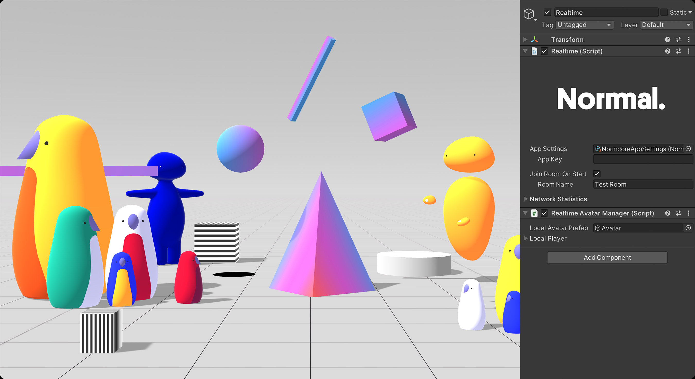
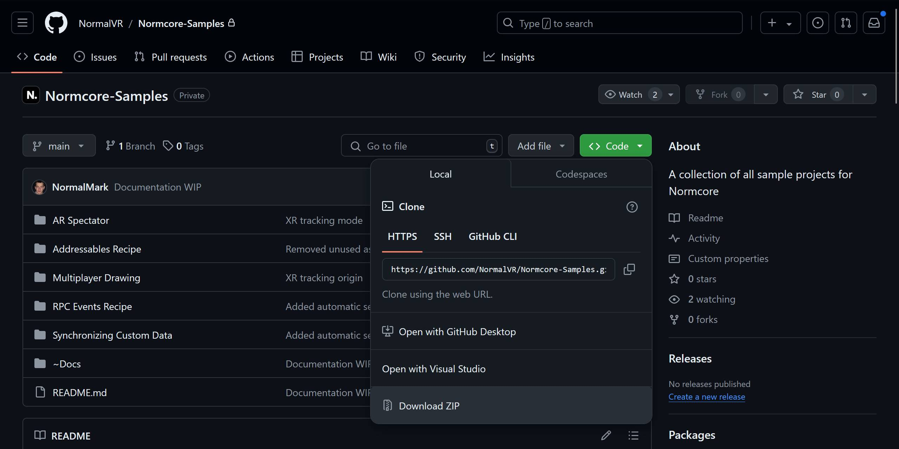
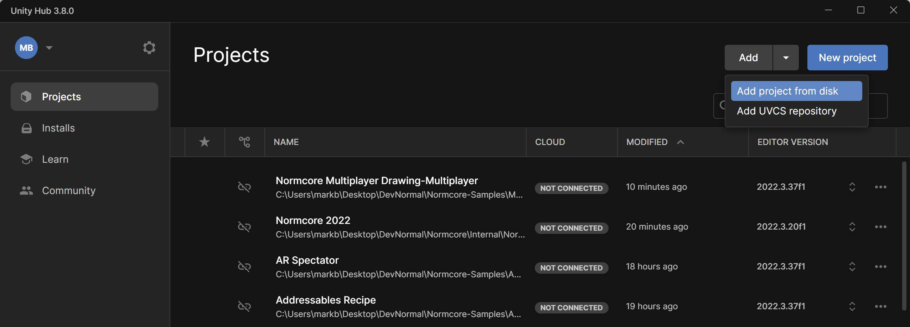

# About
This repository contains samples that illustrate how to use [Normcore](https://normcore.io/) for seamless multiplayer in Unity.

## Guides
Each sample is accompanied by a guide that walks you through the details:
* [Creating a Multiplayer Drawing App](https://normcore.io/documentation/guides/creating-a-multiplayer-drawing-app)
* [Using AR as a Spectator View for Your XR App](https://normcore.io/documentation/guides/using-ar-as-a-spectator-view)
* [Synchronizing Custom Data](https://normcore.io/documentation/realtime/synchronizing-custom-data)
* [Recipe: RPC Events](https://normcore.io/documentation/guides/recipes/rpc-events)
* [Recipe: Using Addressables](https://normcore.io/documentation/guides/recipes/using-addressables)

# Downloading the samples
Click "Download ZIP" or clone the repo using [git](https://docs.github.com/en/get-started/using-git/about-git).

# Opening the samples
* Download and open the [Unity Hub](https://unity.com/unity-hub)
* Click "Add project from disk" and select the root directory of the sample you'd like to open
* If Unity Hub prompts you to install the editor, proceed with the installation

# Running the samples
## Preparation
* Open the main scene inside the sample project
* If you don't already have one, create a Normcore account and application as described in [this page](https://normcore.io/documentation/essentials/getting-started#creating-a-normcore-application)
* Copy your app key into the `Realtime` component and save the scene

## Running
* Enter Play mode by pressing the Play button to launch the sample inside the editor
* There's a few options to run multiple instances of the sample for testing multiplayer, ex:
  * Copy-pasting the sample directory and opening it as a separate project in another editor window
  * [Building and deploying](~Docs/Building.md) the sample to PCVR or Meta Quest
  * Using [ParrelSync](https://github.com/VeriorPies/ParrelSync) to open another editor window

# Building the samples
Follow the steps in [this page](~Docs/Building.md) if you'd like to build and deploy the projects on a platform of your choice.

# Troubleshooting
See [this page](~Docs/Troubleshooting.md) for common questions and answers.

# Versions
The Unity projects in this repo are currently using:

* Unity 2022.3.37f1 (LTS)
* Normcore 2.10.4
* OpenXR plugin by default
* Built-in render pipeline (BiRP)
