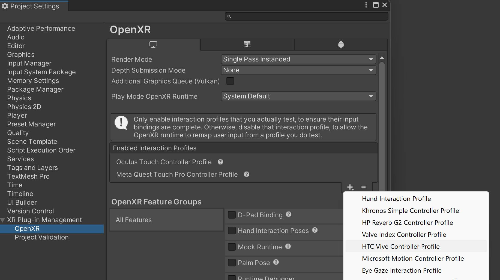

# Troubleshooting

## My app is not connecting / nothing is happening on launch
Make sure that the `Realtime` component in the scene has [a valid app key](https://normcore.io/documentation/essentials/getting-started#creating-a-normcore-application) assigned to it.

## Error: "Realtime: The app key is null or empty. Make sure your NormcoreAppSettings object has a valid app key before connecting."
You're most likely missing an app key on the `Realtime` component.

Follow the steps on [this page](https://normcore.io/documentation/essentials/getting-started#creating-a-normcore-application) to connect successfully.

## XR controller input isn't working
OpenXR needs a list of XR input controllers. We added the Meta Quest controllers by default.

If you're building to a different XR device then you'll have to add its interaction profiles inside this menu:

## I can't switch to the Android build target
If the Android build target is grayed out inside the Build Settings, it means that module isn't installed.

Install it by following [these steps](https://docs.unity3d.com/Manual/android-sdksetup.html).

## How to check logs on Quest/Android
It can be difficult to retrieve error messages from a Quest or Android build.

Luckily the [Android Logcat package](https://docs.unity3d.com/Packages/com.unity.mobile.android-logcat@1.4/manual/getting-started.html) makes this very easy to do directly inside the Unity editor. 
